# Manual-Nmap


Apuntes que fui tomando mientras aprendía a usar Nmap en condiciones: no solo lanzar `nmap -A` y ya, sino entender qué hace cada tipo de escaneo por dentro, cuándo conviene usarlo y cómo hacerlo más sigiloso. Lo comparto por si le sirve a alguien más que esté empezando, como yo.


---

## Índice

- [Por qué este repo](#por-qué-este-repo)
- [El laboratorio](#el-laboratorio)
- [TCP Connect vs SYN Scan, visualmente](#tcp-connect-vs-syn-scan-visualmente)
- [Chuleta rápida de tipos de escaneo](#chuleta-rápida-de-tipos-de-escaneo)
- [¿Qué escaneo uso?](#qué-escaneo-uso)
- [Los escaneos, uno a uno](#los-escaneos-uno-a-uno)
- [Plantillas de velocidad (-T0 a -T5)](#plantillas-de-velocidad--t0-a--t5)
- [Estrategias para pasar desapercibido](#estrategias-para-pasar-desapercibido)
- [Guardar resultados](#guardar-resultados)
- [Scripts NSE](#scripts-nse)
- [Chuleta final de comandos](#chuleta-final-de-comandos)
- [Conclusiones](#conclusiones)

---

## Por qué este repo

En esta práctica trabajo con Nmap, una herramienta fundamental en el mundo de la ciberseguridad que permite escanear redes y descubrir qué dispositivos están conectados, qué puertos tienen abiertos y qué servicios están corriendo en ellos. Para poder experimentar con tranquilidad y sin riesgos, monto un entorno controlado usando Metasploitable 2, que es una máquina virtual diseñada específicamente para practicar técnicas de pentesting porque tiene un montón de vulnerabilidades.

La idea es ir más allá de un simple escaneo básico y explorar los diferentes modos que ofrece Nmap, desde los más ruidosos y fáciles de detectar hasta los más sigilosos, viendo también cómo optimizar los escaneos para que sean más rápidos, eficientes y difíciles de rastrear. Además, pruebo el uso de scripts NSE para sacar información más detallada de los servicios que encuentro.

---

## El laboratorio

Conecto ambas máquinas virtuales (mi Kali y la Metasploitable 2) a la misma red NAT y uso `ifconfig` para comprobar sus IPs. Para comprobar la conectividad entre ambas hago un ping desde mi Kali:

```bash
ping 10.10.10.3
```

```text
PING 10.10.10.3 (10.10.10.3) 56(84) bytes of data.
64 bytes from 10.10.10.3: icmp_seq=1 ttl=64 time=0.410 ms
64 bytes from 10.10.10.3: icmp_seq=2 ttl=64 time=0.916 ms
--- 10.10.10.3 ping statistics ---
4 packets transmitted, 4 received, 0% packet loss, time 3022ms
```

Con el ping ya puedo saber, más o menos, qué sistema operativo hay al otro lado, fijándome en el TTL de los paquetes de respuesta:

| TTL de respuesta | Sistema operativo probable |
|---|---|
| ~64 | Linux / Unix |
| ~128 | Windows |
| ~255 | Cisco / Solaris / algunos dispositivos de red |

> Esto es solo una heurística, no una certeza: el TTL baja un poco por cada salto de red que atraviesa el paquete, y también se puede modificar a propósito. Es una primera pista, no una prueba.

Antes de escanear puertos, echo un vistazo a quién más hay en la red:

```bash
nmap 10.10.10.0/24
```

```text
Nmap scan report for 10.10.10.3
Host is up (0.00015s latency).
Not shown: 977 closed tcp ports (reset)
PORT      STATE SERVICE
21/tcp    open  ftp
22/tcp    open  ssh
23/tcp    open  telnet
25/tcp    open  smtp
53/tcp    open  domain
80/tcp    open  http
111/tcp   open  rpcbind
139/tcp   open  netbios-ssn
445/tcp   open  microsoft-ds
512/tcp   open  exec
513/tcp   open  login
514/tcp   open  shell
1099/tcp  open  rmiregistry
1524/tcp  open  ingreslock
2049/tcp  open  nfs
2121/tcp  open  ccproxy-ftp
3306/tcp  open  mysql
5432/tcp  open  postgresql
5900/tcp  open  vnc
6000/tcp  open  X11
6667/tcp  open  irc
8009/tcp  open  ajp13
8180/tcp  open  unknown

Nmap done: 256 IP addresses (4 hosts up) scanned in 6.75 seconds
```

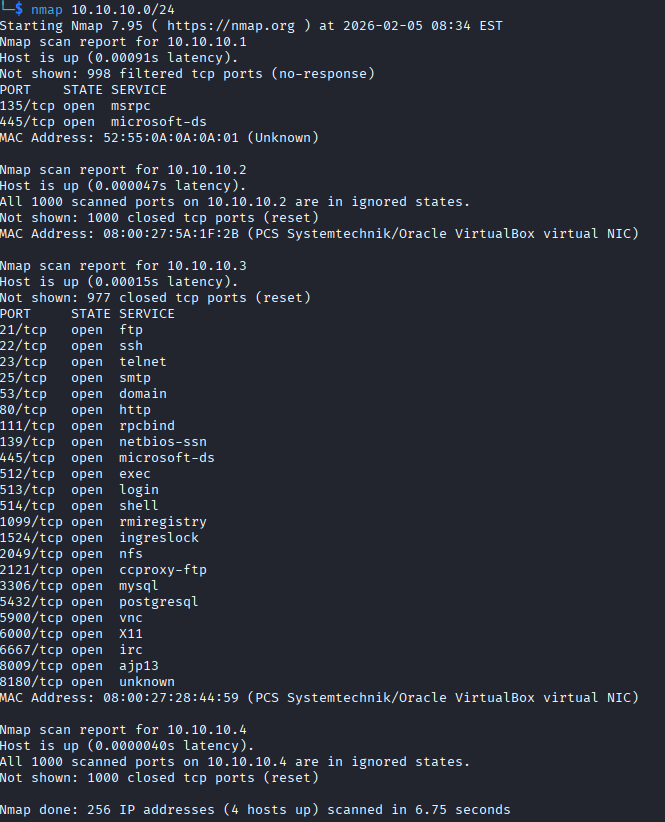

Una forma más rápida y discreta de saltarme el descubrimiento de hosts (el ping inicial) y la resolución DNS es esta:

```bash
nmap 10.10.10.3 -Pn -n
```

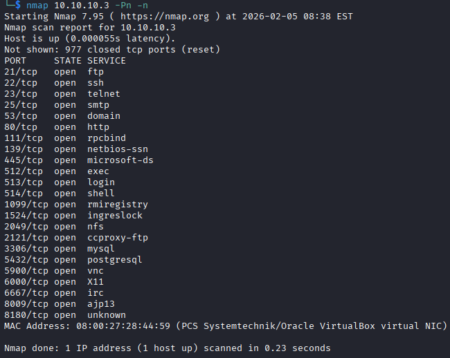

El parámetro **-Pn** le indica a Nmap que omita la fase de descubrimiento de hosts, obligándolo a escanear el objetivo asumiendo que está encendido aunque no responda a las solicitudes de eco. El parámetro **-n** desactiva la resolución inversa de DNS, es decir, Nmap no intentará traducir la IP en un nombre de dominio. Con esto el escaneo es mucho más rápido y genera menos ruido en los registros de la red.

---

## TCP Connect vs SYN Scan, visualmente

La diferencia entre `-sT` y `-sS` se entiende mejor viéndola que leyéndola. Esto es lo que pasa "por debajo" en cada una:

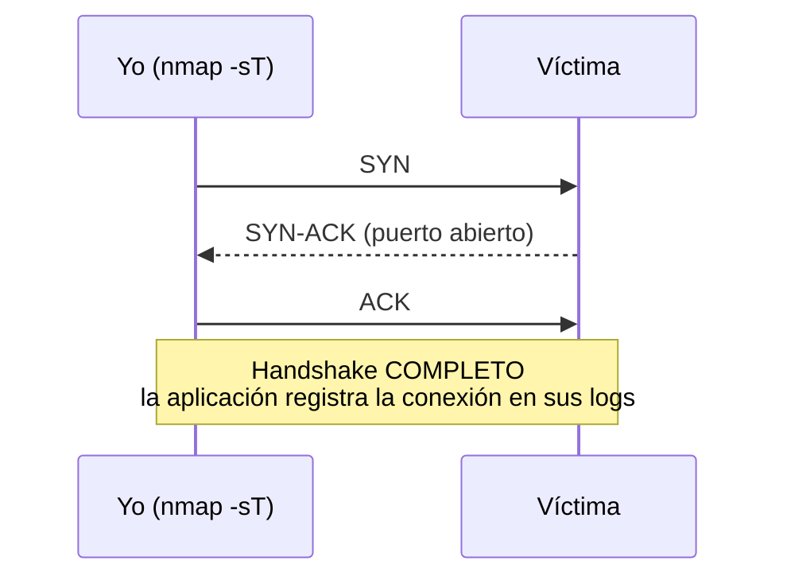

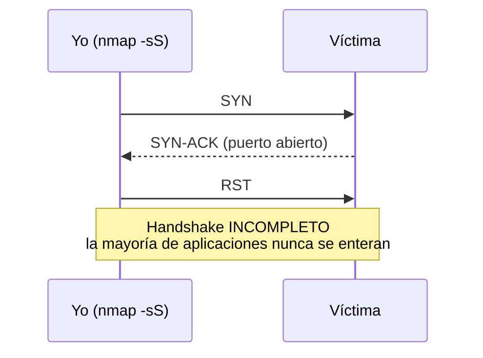

Es la misma información (el puerto está abierto en los dos casos), pero en el SYN scan corto la conexión antes de que se complete, así que muchos servicios ni se enteran de que los he tocado.

---

## Chuleta rápida de tipos de escaneo

| Flag | Nombre | ¿Necesita root? | Protocolo | Sigilo | Para qué lo uso |
|---|---|---|---|---|---|
| `-sT` | TCP Connect | No | TCP | Bajo, queda en logs | Cuando no tengo privilegios de root |
| `-sS` | SYN / Stealth | Sí | TCP | Alto | Mi escaneo "por defecto", rápido y discreto |
| `-sU` | UDP | Recomendado | UDP | — | Buscar DNS, SNMP y otros servicios UDP |
| `-sY` | SCTP INIT | Sí | SCTP | — | Auditar infraestructura de telecom (4G/5G) |
| `-sA` | ACK | Sí | TCP | — | Mapear reglas de firewall (filtered/unfiltered) |
| `-sF` | FIN | Sí | TCP | Alto ante IDS simples | Evadir filtros que solo miran paquetes SYN |
| `-sX` | Xmas (FIN+PSH+URG) | Sí | TCP | Medio (IDS modernos lo detectan) | Lo mismo que FIN, más "ruidoso" de flags |
| `-sV` | Detección de versión | No | — | Bajo, es intrusivo | Saber la versión exacta de cada servicio |
| `-O` | Fingerprint de SO | Sí | — | — | Identificar el sistema operativo objetivo |

---

## ¿Qué escaneo uso?

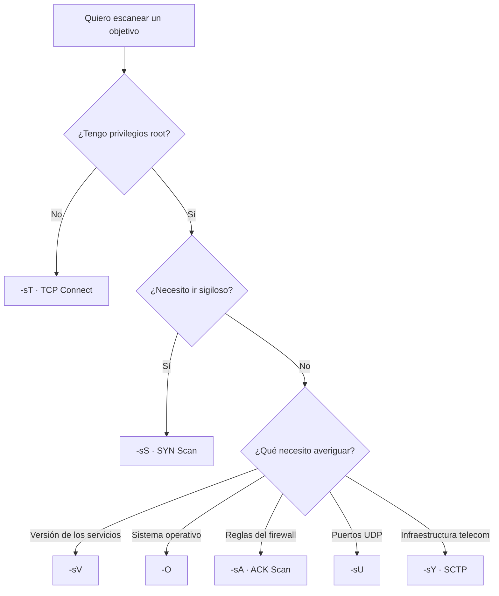

---

## Los escaneos, uno a uno

<details>
<summary><strong>Escaneo TCP Connect (-sT)</strong></summary>

Se utiliza el protocolo TCP para establecer una conexión completa con cada puerto del objetivo y determinar si está abierto o cerrado. Es el escaneo que uso cuando no tengo privilegios de administrador o root: es más lento, más detectable, y deja registros en los logs de la aplicación porque completa el three-way handshake entero.

```bash
nmap -sT 10.10.10.3
```

```text
PORT     STATE SERVICE
21/tcp   open  ftp
22/tcp   open  ssh
23/tcp   open  telnet
25/tcp   open  smtp
53/tcp   open  domain
...
```

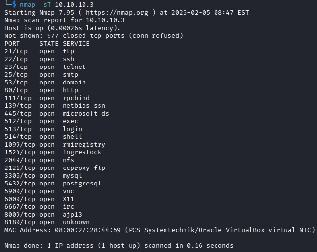

</details>

<details>
<summary><strong>Escaneo SYN / Stealth Scan (-sS)</strong></summary>

Este método envía un paquete SYN y espera una respuesta SYN-ACK para determinar el estado del puerto. Es un escaneo sigiloso y rápido: evita completar el handshake del RFC 793, lo que impide que la aplicación registre la conexión y permite evadir sistemas de monitoreo básicos que solo auditan conexiones completas.

```bash
nmap -sS 10.10.10.3
```

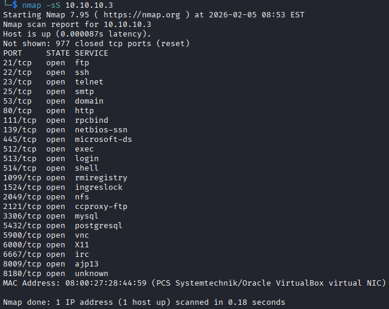

Los resultados son los mismos puertos que con `-sT`, pero el escaneo es más rápido y mucho más discreto.

</details>

<details>
<summary><strong>Escaneo UDP (-sU)</strong></summary>

Busca puertos UDP abiertos, esencial para identificar servicios que utilizan este protocolo, como DNS y SNMP. Descubre servicios que TCP no detecta, pero es muy lento y puede dar falsos positivos. Uso `--host-timeout` para que no se quede eternamente esperando respuesta de puertos filtrados.

```bash
nmap -sU --open 10.10.10.3
```

```text
Discovered closed port 49306/udp on 10.10.10.3
Discovered closed port 515/udp on 10.10.10.3
...
```

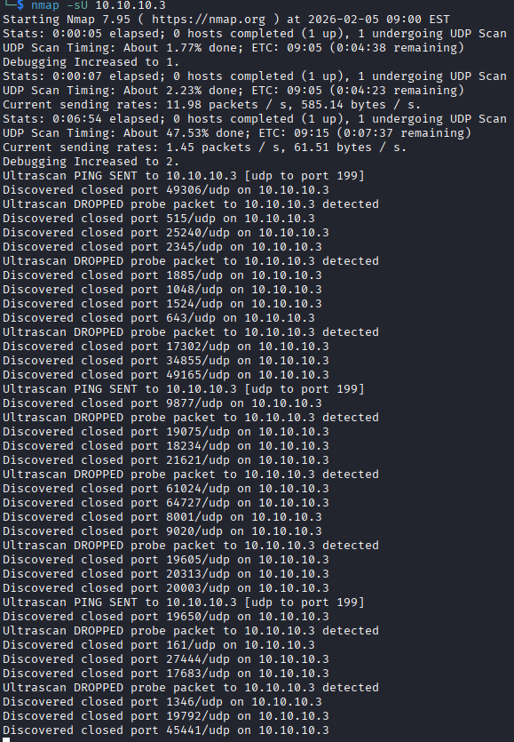

Con `--open` le pido que solo me muestre los puertos que sí están abiertos, para no llenarme la pantalla de puertos cerrados.

</details>

<details>
<summary><strong>Escaneo SCTP (-sY)</strong></summary>

Utiliza el protocolo SCTP (Stream Control Transmission Protocol), un protocolo de capa de transporte menos común que TCP/UDP pero importante en telecomunicaciones y redes móviles. Funciona enviando paquetes SCTP INIT al objetivo: si recibe INIT-ACK el puerto está abierto, si recibe ABORT está cerrado, y sin respuesta está filtrado. Requiere privilegios de administrador y se usa para auditar infraestructura de telecomunicaciones (4G/5G), ya que muchos firewalls tradicionales no están configurados para filtrar específicamente este protocolo.

```bash
sudo nmap -sY -p 2905,2944,3868,36412,38412 --open 10.10.10.3
```

```text
Nmap done: 1 IP address (1 host up) scanned in 0.19 seconds
```

En mi caso no tiene ningún puerto SCTP abierto.

</details>

<details>
<summary><strong>Escaneo ACK (-sA)</strong></summary>

Envía paquetes TCP con el flag ACK activado y se utiliza principalmente para mapear reglas de firewall y determinar si los puertos están filtrados o no filtrados. Cuando un puerto responde con RST está "sin filtrar" (el firewall permite el tráfico); si no hay respuesta está "filtrado" (Nmap no sabe si el puerto está abierto porque un firewall está bloqueando sus paquetes). Requiere privilegios de root y es útil para identificar qué puertos pasan a través de firewalls stateless.

```bash
sudo nmap -sA -T4 10.10.10.3
```

```text
All 1000 scanned ports on 10.10.10.3 are in ignored states.
Not shown: 1000 unfiltered tcp ports (reset)
```

En mi caso, Metasploitable 2 no tiene firewall, así que todos los puertos salen como "unfiltered" — no hay nada bloqueándolos.

> Aquí uso `-T4`, que aumenta la velocidad de escaneo (`-T5` es la máxima velocidad y la más detectable; `-T1` la mínima y menos detectable).

</details>

<details>
<summary><strong>Escaneo FIN (-sF)</strong></summary>

Envía paquetes TCP con solo el flag FIN activado y se basa en el comportamiento del RFC 793: si un puerto está cerrado debería responder con RST, mientras que un puerto abierto simplemente ignora el paquete. Es útil para evadir firewalls e IDS simples que solo filtran paquetes SYN. Sin embargo, no funciona contra sistemas Windows (su pila TCP/IP no sigue esa parte del RFC a rajatabla) y puede dar resultados inconsistentes. Requiere privilegios de root.

```bash
sudo nmap -sF --top-ports 100 --open 10.10.10.3
```

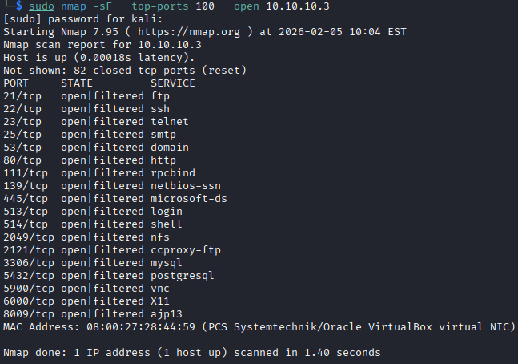

Con `--top-ports 100` le pido a Nmap que se centre solo en los 100 puertos más comunes según su base de datos de frecuencia, en vez de escanear los 1000 por defecto.

</details>

<details>
<summary><strong>Escaneo Xmas (-sX)</strong></summary>

Envía paquetes TCP con los flags FIN, PSH y URG activados simultáneamente (se llama "Xmas" porque el paquete está "iluminado" como un árbol de Navidad). Funciona igual que el escaneo FIN: si el puerto está cerrado responde con RST, si está abierto no responde. Se usa para evadir firewalls básicos y algunos IDS antiguos, pero los sistemas de detección modernos lo identifican fácilmente por ser una combinación de flags anormal y sospechosa. Tampoco funciona contra Windows.

```bash
sudo nmap -sX 10.10.10.3
```

</details>

<details>
<summary><strong>Escaneo de versiones (-sV)</strong></summary>

Este modo intenta identificar las versiones exactas de los servicios que corren en los puertos abiertos (por ejemplo, Apache 2.4.41, OpenSSH 8.2, MySQL 5.7). Nmap se conecta a cada puerto y envía sondas específicas para provocar que el servicio revele su versión mediante banners o respuestas características. Es extremadamente útil en pentesting para buscar vulnerabilidades conocidas asociadas a versiones específicas de software, pero es más lento que un escaneo básico y más intrusivo, ya que genera conexiones reales.

```bash
nmap -sV -T3 10.10.10.3
```

```text
PORT     STATE SERVICE     VERSION
21/tcp   open  ftp         vsftpd 2.3.4
22/tcp   open  ssh         OpenSSH 4.7p1 Debian 8ubuntu1 (protocol 2.0)
23/tcp   open  telnet      Linux telnetd
25/tcp   open  smtp        Postfix smtpd
53/tcp   open  domain      ISC BIND 9.4.2
80/tcp   open  http        Apache httpd 2.2.8 ((Ubuntu) DAV/2)
...
```

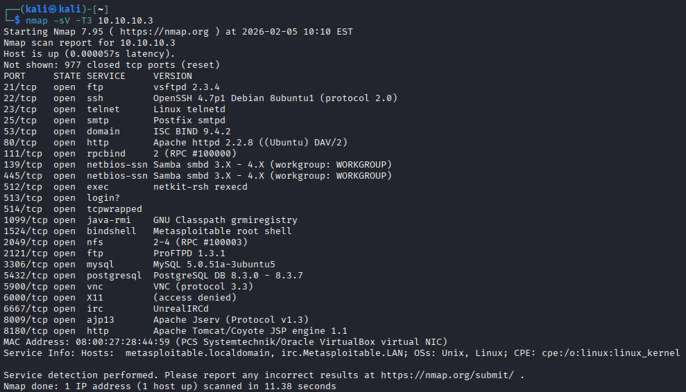

Como es algo intrusivo y fácil de detectar, busco una forma de hacerlo menos perceptible:

```bash
nmap -sS -sV --version-intensity 0 -T2 --top-ports 100 10.10.10.3
```

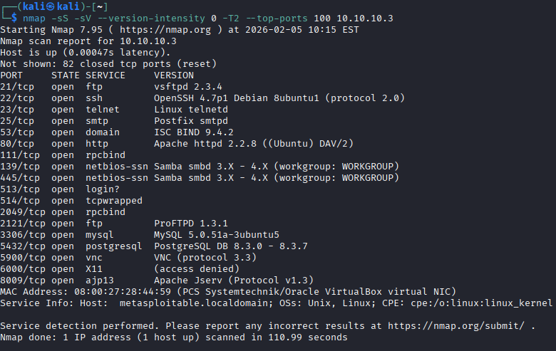

Al bajar la intensidad de versiones a 0 y limitar los puertos a los más comunes, Nmap deja de enviar ráfagas de pruebas agresivas que "cantan mucho" ante un IDS, comportándose de forma más parecida a un error de red aleatorio que a una auditoría técnica. Combinado con `-sS` (que no completa el handshake), evito que la mayoría de los servicios registren una conexión establecida en sus logs de aplicación.

</details>

<details>
<summary><strong>Escaneo de sistema operativo (-O)</strong></summary>

Realiza fingerprinting del sistema operativo analizando las respuestas TCP/IP del objetivo: valores TTL, tamaño de ventana TCP, opciones TCP y comportamiento general de la pila de red, comparándolo contra una base de datos de firmas conocidas. Es útil para planear ataques específicos según el OS detectado, pero requiere privilegios de root y puede ser inexacto si el objetivo tiene firewall o usa técnicas de ofuscación.

```bash
nmap -O 10.10.10.3
```

```text
Device type: general purpose
Running: Linux 2.6.X
OS CPE: cpe:/o:linux:linux_kernel:2.6
OS details: Linux 2.6.9 - 2.6.33
Network Distance: 1 hop
```

</details>

---

## Plantillas de velocidad (-T0 a -T5)

Nmap trae seis plantillas de temporización que ajustan lo agresivo (y lo ruidoso) que es el escaneo:

| Plantilla | Nombre | Cuándo la uso |
|---|---|---|
| `-T0` | Paranoid | Máximo sigilo, escaneo extremadamente lento (evasión de IDS muy estricta) |
| `-T1` | Sneaky | Muy lento, poco detectable |
| `-T2` | Polite | Reduce la carga de red, más lento de lo normal |
| `-T3` | Normal | Comportamiento por defecto de Nmap |
| `-T4` | Aggressive | El que más uso en el laboratorio: rápido, asumiendo una red fiable |
| `-T5` | Insane | Máxima velocidad, muy detectable, a veces sacrifica precisión |

---

## Estrategias para pasar desapercibido

### El truco de los señuelos (-D)

Nmap envía paquetes desde mi IP, pero al mismo tiempo lanza paquetes idénticos desde otras IPs que yo (o quien use el flag) elija. Para el administrador del objetivo, parecerá que 10 o 20 personas lo están escaneando a la vez, y no sabrá cuál es el ataque real.

```bash
nmap -sS -sV -D RND:10 10.10.10.3
```

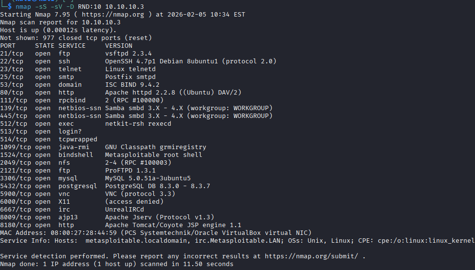

`RND:10` le dice a Nmap que genere 10 señuelos aleatorios.

### Fragmentación (-f)

Divide los paquetes en trozos pequeños para confundir a los IDS que no reconstruyen bien el tráfico. Es el complemento perfecto para una estrategia de sigilo. La fragmentación no cambia los resultados obtenidos, sino la forma en que se envían los paquetes: los sistemas IDS/IPS tienen más dificultad para detectar que están siendo escaneados porque los paquetes llegan fragmentados.

```bash
nmap -f -sS 10.10.10.3
```

> Aviso honesto: hoy en día la mayoría de firewalls y IDS modernos reconstruyen los fragmentos antes de inspeccionar el tráfico, así que esta técnica es bastante más efectiva contra equipos antiguos o mal configurados que contra una defensa actualizada. La incluyo porque es importante entenderla, no porque sea infalible.

---

## Guardar resultados

En una práctica profesional nunca se escanea solo para ver la pantalla: hay que exportar los resultados para analizarlos después.

| Flag | Formato | Para qué sirve |
|---|---|---|
| `-oN` | Normal | Igual que la salida por pantalla, pero en un `.txt` |
| `-oX` | XML | Importar en bases de datos o herramientas como Zenmap |
| `-oG` | Grepable | Buscar rápido con `grep`/`awk` desde terminal |

```bash
nmap -sS -sV --version-intensity 0 -T2 --top-ports 100 -oN resultados.txt 10.10.10.3
```

```text
# Nmap 7.95 scan initiated ... as: nmap --privileged -sS -sV --version-intensity 0 -T2 --top-ports 100 -oN resultados.txt 10.10.10.3
Nmap scan report for 10.10.10.3
...
Nmap done: 1 IP address (1 host up) scanned in 110.98 seconds
```

---

## Scripts NSE

Los scripts de Nmap (NSE, Nmap Scripting Engine) están escritos en **Lua**, un lenguaje de programación ligero, potente y muy fácil de leer, diseñado específicamente para ser incrustado en aplicaciones.

Hay tres formas principales de invocarlos:

| Forma | Ejemplo | Qué hace |
|---|---|---|
| Por defecto | `nmap -sC objetivo` | Ejecuta un conjunto de scripts seguros y útiles para identificación general (equivale a `--script=default`) |
| Por categoría | `nmap --script vuln objetivo` | Nmap organiza sus cientos de scripts en categorías: `discovery`, `vuln`, `safe`, `auth`, etc. |
| Script concreto | `nmap --script http-title objetivo` | Si ya sé el nombre exacto del script, lo lanzo directamente |

### Scripts que más uso para recopilar información

<details>
<summary><strong>dns-brute</strong> — adivina subdominios</summary>

Si estoy escaneando un dominio, este script intenta adivinar subdominios usando una lista de palabras.

```bash
nmap --script dns-brute objetivo.com
```

</details>

<details>
<summary><strong>http-enum</strong> — escáner de directorios básico</summary>

Busca carpetas comunes en servidores web (como `/admin`, `/config`, `/phpmyadmin`) que no están a la vista pero que pueden contener información crítica.

```bash
nmap --script http-enum 10.10.10.3
```

</details>

<details>
<summary><strong>ssh-hostkey</strong> — huella digital del servidor SSH</summary>

Extrae las claves públicas del servidor SSH. Esto permite identificar si el servidor ha sido clonado o si se está usando una clave conocida y poco segura — es el fingerprinting del servidor.

```bash
nmap --script ssh-hostkey 10.10.10.3
```

</details>

<details>
<summary><strong>smb-os-discovery</strong> — información vía SMB</summary>

Intenta determinar, a través del protocolo SMB (carpetas compartidas), el nombre de la computadora, el dominio y, lo más importante, la versión exacta del sistema operativo.

```bash
nmap --script smb-os-discovery 10.10.10.3
```

</details>

<details>
<summary><strong>banner</strong> — el más simple, y muy efectivo</summary>

Se conecta al puerto y espera a que el servicio diga "Hola, soy el servidor X versión Y". Es más ligero que `-sV`.

```bash
nmap --script banner 10.10.10.3
```

</details>

---

## Chuleta final de comandos

```bash
# Descubrir hosts vivos en la red
nmap 10.10.10.0/24

# Escaneo rápido sin ping ni resolución DNS
nmap -Pn -n 10.10.10.3

# SYN scan clásico (necesita root)
sudo nmap -sS 10.10.10.3

# Versión de servicios + SO
sudo nmap -sV -O 10.10.10.3

# Escaneo sigiloso combinando varias técnicas
sudo nmap -sS -sV --version-intensity 0 -T2 --top-ports 100 10.10.10.3

# Con señuelos, para camuflar el origen real
sudo nmap -sS -D RND:10 10.10.10.3

# UDP solo con puertos abiertos
sudo nmap -sU --open 10.10.10.3

# Guardar en los tres formatos a la vez
sudo nmap -sS -sV -oN scan.txt -oX scan.xml -oG scan.grep 10.10.10.3

# Scripts básicos de reconocimiento
nmap -sC -sV 10.10.10.3
```

---

## Conclusiones

Después de completar esta práctica me queda claro que Nmap es mucho más que un simple escáner de puertos. He aprendido que cada tipo de escaneo tiene su propósito específico: desde el TCP Connect, que es el más básico pero deja rastro en los logs, hasta el SYN scan, que es más sigiloso, pasando por técnicas como los escaneos FIN y Xmas que aprovechan las peculiaridades del protocolo TCP para evadir detección.

Lo que más me ha sorprendido es la cantidad de opciones que hay para hacer los escaneos más discretos, como el uso de señuelos para ocultar mi IP real o la fragmentación de paquetes para confundir a los sistemas de detección. También he visto lo útiles que son los scripts NSE para automatizar tareas de reconocimiento y sacar información valiosa sin tener que conectarme manualmente a cada servicio.

En definitiva, esta práctica me ha enseñado que hacer un buen reconocimiento no es solo lanzar comandos a lo loco, sino entender qué estoy buscando, cómo hacerlo de forma eficiente y, sobre todo, cómo adaptarme según el entorno para pasar desapercibido cuando sea necesario.
